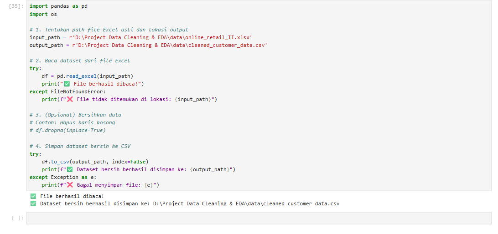

# 🧹📊 Data Cleaning & Exploratory Data Analysis (EDA)

Proyek ini berfokus pada pembersihan data dan analisis eksploratif terhadap data pelanggan. Tujuannya adalah untuk memahami pola perilaku, karakteristik demografis, serta tren pendapatan dan kepuasan pelanggan, sebelum masuk ke tahap pemodelan atau pengambilan keputusan bisnis.

## 🎯 Tujuan Proyek

- Membersihkan data mentah agar siap dianalisis
- Menangani data hilang, outlier, dan ketidakkonsistenan
- Melakukan visualisasi data secara informatif
- Menyusun insight awal untuk mendukung strategi bisnis

## 🧰 Teknologi yang Digunakan

- Python
- Pandas & NumPy
- Seaborn & Matplotlib
- Jupyter Notebook

## 🖼️ Cuplikan Proses

### 🟢 Dataset Sukses Dimuat

### 📊 Contoh Output Visualisasi

### 📁 File Dibaca dengan Sukses

## 🔍 Ringkasan Analisis

Beberapa langkah utama yang dilakukan dalam proyek ini:

- **Imputasi Missing Values**: Pendekatan median dan mode digunakan untuk mengisi nilai kosong.
- **Deteksi Outlier**: Visualisasi boxplot digunakan untuk mengidentifikasi nilai ekstrem yang mengganggu.
- **Transformasi Tipe Data**: Tanggal bergabung pelanggan diformat ulang untuk kebutuhan analisis tren.
- **Visualisasi Interaktif**:
  - Distribusi pendapatan per jenis kelamin
  - Hubungan pendidikan dengan kepuasan pelanggan
  - Tren waktu berdasarkan tanggal bergabung

## 📈 Insight Kunci

- Rata-rata pendapatan pelanggan meningkat seiring waktu bergabung.
- Pelanggan dengan latar belakang pendidikan tinggi cenderung memiliki tingkat kepuasan lebih tinggi.
- Terdapat variasi pendapatan yang cukup mencolok antar gender.
- Segmentasi awal menunjukkan adanya kelompok pelanggan potensial dengan kepuasan tinggi namun pendapatan rendah.

## 📬 Kontak

**Angeline Feliciana Hutahaean**  
📍 Medan, North Sumatera, Indonesia  
📧 angelinefelicianahutahaean@gmail.com  
🔗 [LinkedIn](https://linkedin.com/in/angelinefelicianahutahaean)

---

> "Data yang bersih adalah fondasi dari keputusan yang cerdas."
